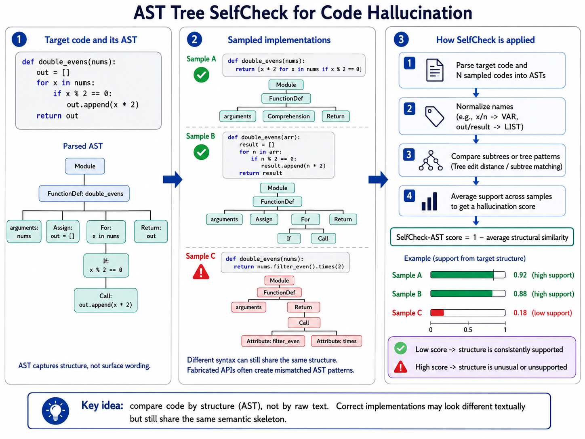

Initial methods design for computing similarity between coding task responses (T=0 for main implementation, T=1 for N=20 sample implementations)

- **SelfCheck-Exec**: same inputs will produce same outputs
    - Replaces original BERT score
    - put input sets (x1, x2, ...) to all main/sample implementations and compare the output values
- **SelfCheck-AST**: hallucinated implementations will vary in semantic structure a lot
    - Compare AST tree similarity between main/samples
    - Replaces n-gram score
    -   
**SelfCheck-Prompt**: Just ask other LLM as a judge

```
Does the following construct from another implementation
have behavior consistent with the implementation above?
Construct: {unit from R}
Answer Yes / No / N/A with a one-sentence justification.
```

