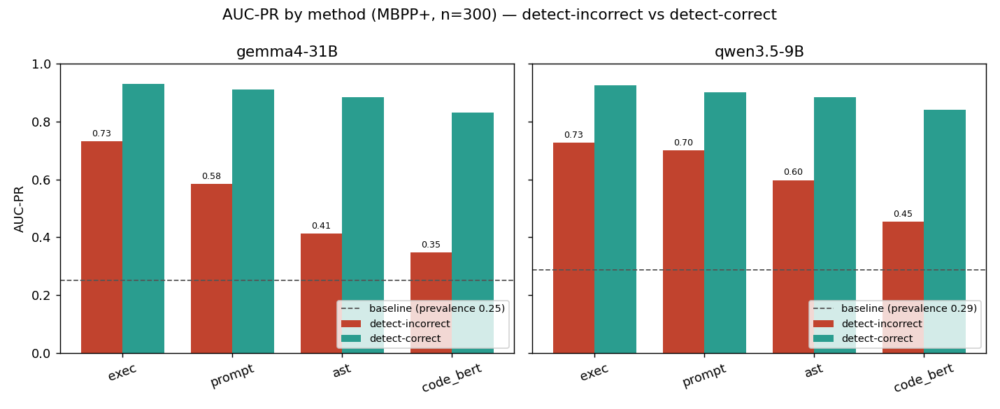
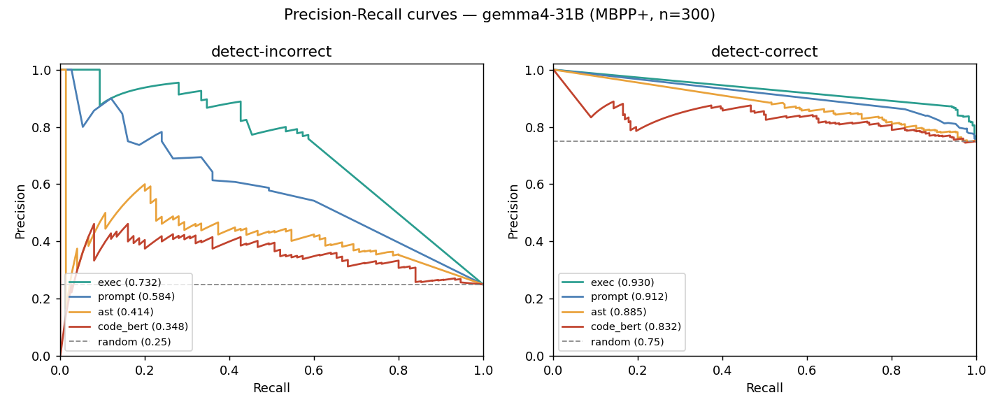
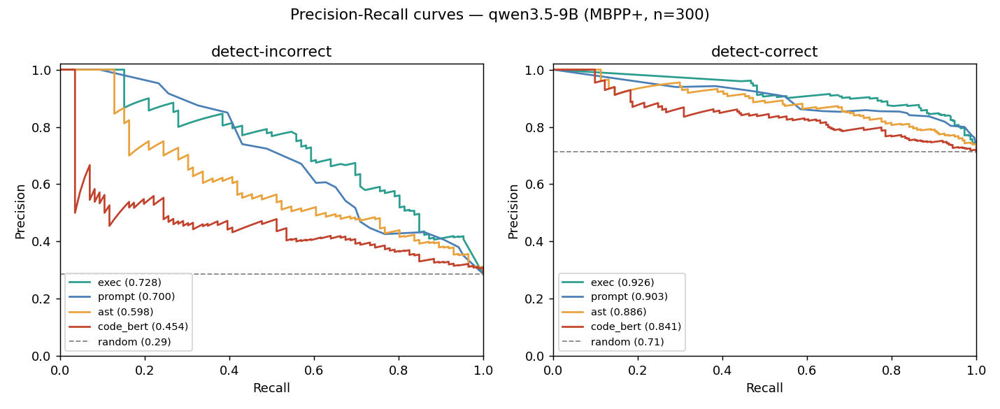
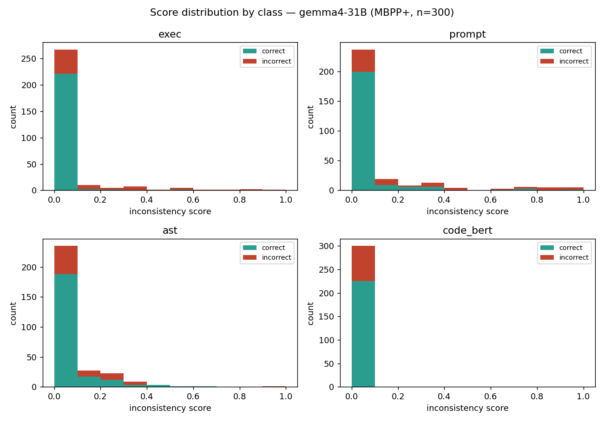
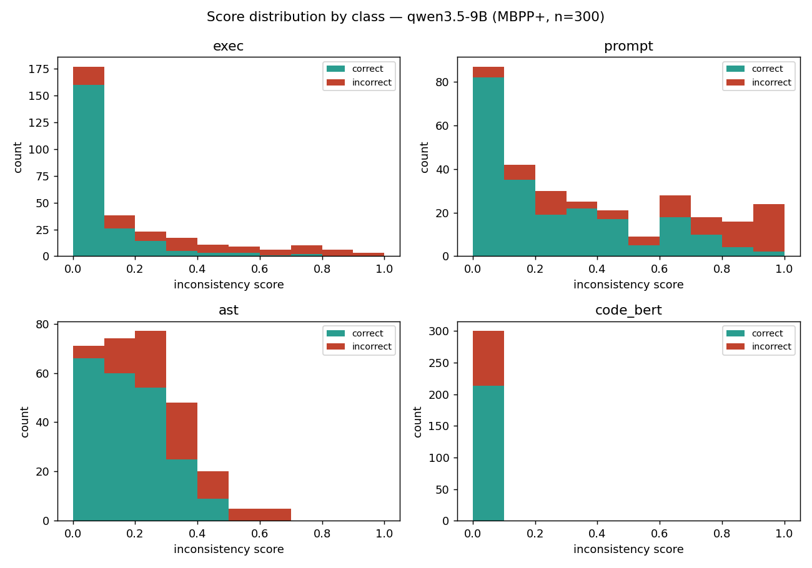

# Improvement 2 — Code-Hallucination Detection (MBPP+ Analysis)

*AI Ethics Team 15 · SelfCheckGPT replication · Improvement 2*

## 1. What & why

SelfCheckGPT's idea, applied to code: a model that truly knows a solution writes it
**consistently** across resamples; a hallucinated solution **drifts**. Here a hallucination is
just **incorrect code**, and correctness is checked by running it — no human labels needed. We
score the consistency between one main answer (temperature 0) and N=20 samples (temperature 1)
with four methods, all on the same generations:

- **exec** — behavioral: do the implementations return the same outputs on shared inputs?
- **prompt** — LLM-as-judge: is each sample's behavior consistent with the main?
- **ast** — structural: node-type fingerprint similarity (rename/literal-invariant).
- **code_bert** — embedding: cosine similarity of CodeBERT embeddings.

Higher score = more likely incorrect. We report each method's **AUC-PR split into
detect-incorrect and detect-correct**, read against the prevalence baseline.

## 2. Setup

- **Dataset:** MBPP+ (EvalPlus), first 300 problems, ~100 test inputs each.
- **Models:** two local sub-9B-class models — `gemma4-31B` and `qwen3.5-9B`.
- **Per problem:** 1 main + 20 samples; exec ground truth from the canonical solution.
- **Scope:** MBPP+ only. HumanEval+ and CodeHaluEval analysis is future work (Section 7).

| Model | n | incorrect | correct | baseline (incorrect prevalence) |
|-------|---|-----------|---------|-------------------------------|
| gemma4-31B | 300 | 75 | 225 | 0.250 |
| qwen3.5-9B | 300 | 86 | 214 | 0.287 |

## 3. Result — AUC-PR

AUC-PR detect-incorrect / detect-correct (read against the baseline; the no-skill floor):

| Method | gemma4 incorrect | gemma4 correct | qwen incorrect | qwen correct |
|--------|:---:|:---:|:---:|:---:|
| **exec** | **0.733** | 0.930 | **0.728** | 0.926 |
| **prompt** | 0.584 | 0.912 | 0.700 | 0.903 |
| **ast** | 0.414 | 0.885 | 0.598 | 0.886 |
| **code_bert** | 0.348 | 0.832 | 0.454 | 0.841 |
| *baseline* | *0.250* | — | *0.287* | — |



**Ranking (both models): exec > prompt > ast > code_bert.** exec clears the baseline by ~3×
on detect-incorrect; code_bert sits just above it (≈ no skill). detect-correct is uniformly
high — but that is partly the **75% correct prevalence**, so it must be read against the
baseline, not in isolation.

## 4. Result — Precision-Recall curves




On **detect-incorrect**, exec holds high precision across the recall range; prompt trails;
ast and code_bert collapse toward the random floor. On **detect-correct** all methods ride
well above the (high) random line — easy because most mains are correct — which is exactly why
detect-incorrect is the discriminating view.

## 5. Per-method analysis




- **exec — strongest.** Behavioral divergence is the cleanest hallucination signal; Spearman
  0.55–0.59. Incorrect mains spread up the score axis while correct mains pile at 0.
- **prompt — second.** A useful oracle-free judge, weaker than exec and model-dependent
  (qwen 0.70 vs gemma 0.58 detect-incorrect): the smaller model's samples vary more, giving the
  judge more to disagree about.
- **ast — weak.** Structure barely tracks correctness (AUC 0.41–0.60); rename/literal-invariant
  fingerprints look similar whether the logic is right or wrong.
- **code_bert — negative result.** Near the baseline. The histogram tells the story: **every**
  problem lands in the `[0.0, 0.1)` bin — CodeBERT embeddings are anisotropic (cosine ≈ 1 for
  all code), so the score barely moves and carries almost no signal.

## 6. The confident-consistent blind spot

Every consistency method shares one limit: when the model is **consistently wrong**, the
samples agree with a wrong main, divergence ≈ 0, and the hallucination is invisible. The
`[0.0, 0.1)` bin of the exec histogram holds **41 incorrect mains** (gemma) that score ≈ 0.

Concrete case — **Mbpp/101** (exec = 0.000, yet 93/107 inputs fail):

> *Write a function to find the kth element in the given array using 1-based indexing.*
> `kth_element([12,3,5,7,19], 2) == 3`

```python
# main — and all 20 samples agree (only 2 distinct bodies, both identical in behavior)
def kth_element(arr, k):
    return sorted(arr)[k-1]
```

The model reads "kth element" as "kth **smallest**" and sorts. The intended answer is the
element already at position k (`arr[k-1]`, no sort). The misreading is **systematic** — all
samples make it — so exec sees perfect agreement and scores 0. No zero-resource consistency
method can catch this without an oracle. This is the direct bridge to **Improvement 1**
(high-certainty hallucinations): a confidently-held wrong belief produces consistent, confident,
wrong output.

## 7. Key conclusion

- **exec is the reliable code-hallucination detector** among the four, on both models —
  behavioral consistency >> structural (ast) or embedding (code_bert) similarity.
- **code_bert is a negative result**: embedding saturation leaves it at the no-skill baseline.
- **The shared limit is the confident-consistent blind spot** — consistency detects *drift*,
  not *confident error*; closing it needs an external signal (Improvement 1's direction).
- **Future work:** extend this analysis to HumanEval+ and CodeHaluEval (the stdin/stdout
  stress test built to induce hallucinations); the figure script and structure already
  generalize.

---

*Figures regenerate with `python scripts/make_analysis_figures.py`; every annotated AUC matches
`python run_codecheck.py evaluate --results <file>`.*
